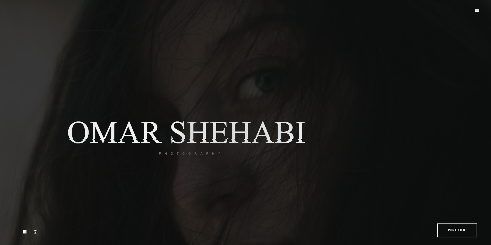
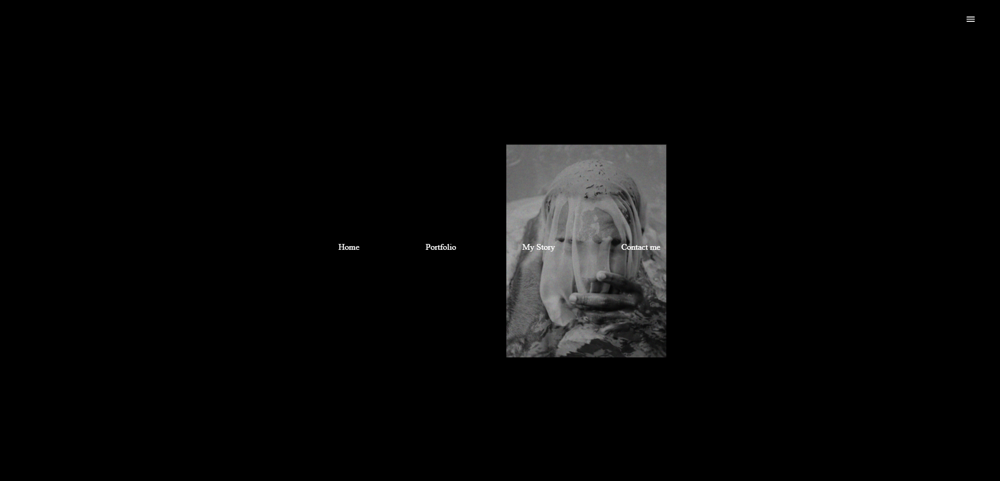
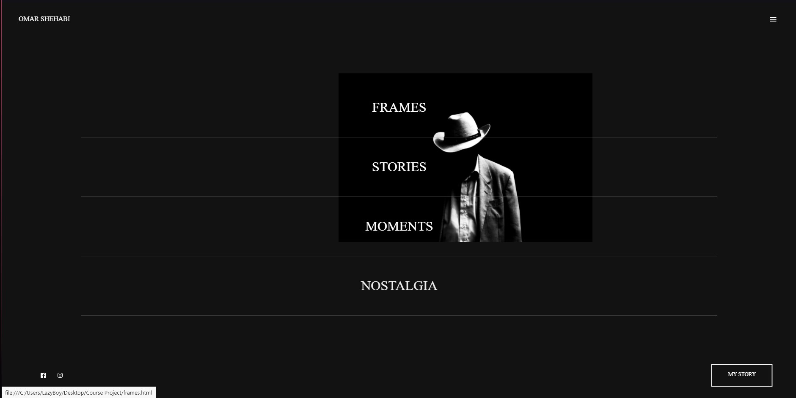
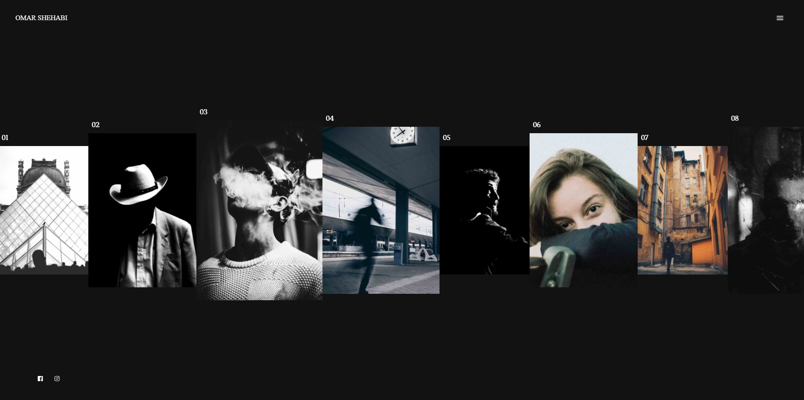
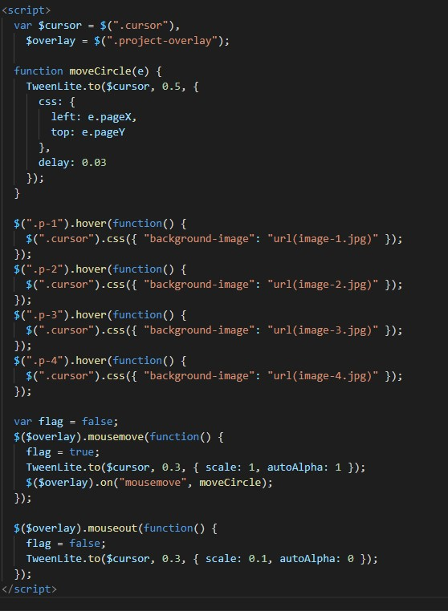
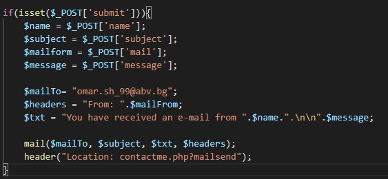
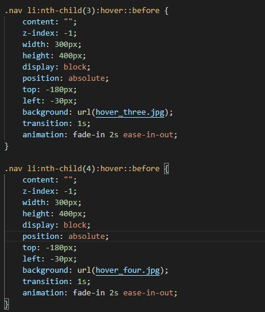
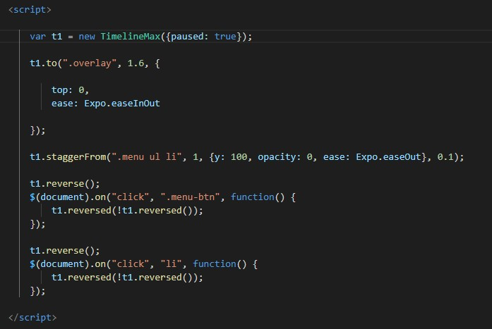

# Photographer portfolio website

## Table of contents
* [General info](#general-info)
* [Screenshots](#screenshots)
* [Technologies](#technologies)
* [Setup](#setup)
* [Features](#features)
* [Status](#status)
* [Inspiration](#inspiration)
* [Contact](#contact)

## General info
This website is a small project I worked on as I started learning web development. I decided to further improve it and upgrade it so I can use it as a place to showcase my photography. 
I did a lot of experimenting with different funcionalities and designs, so far the website is majorly
front-end oriented. My future plans include adding more back-end that can help me manage the uploaded content
as well as making it more user friendly and responsive. I have learned a lot about web design by making 
this as my first website and tried to bring my ideas to life by using many different sources and inspirations.
## Screenshots

## Technologies
* HTML
* CSS
* Javascript
* PHP

## Code Examples

## Features
List of features ready and TODOs for future development
* User-friendly interface
* Direct contact to host through email using PHP
* Smooth animations
* Work-in-progress Signup/Login system
* Navigation bar
* Project selection page

To-do list:
* Reponsiveness to different devices
* Page loader
* Admin page for content managment 
* Blog 
* Comment section

## Status
Project is: _work in progress_

## Inspiration
Project inspired by CodeGrid, CoDrops, Dani Krossing

## Contact
omar.sh990@gmail.com